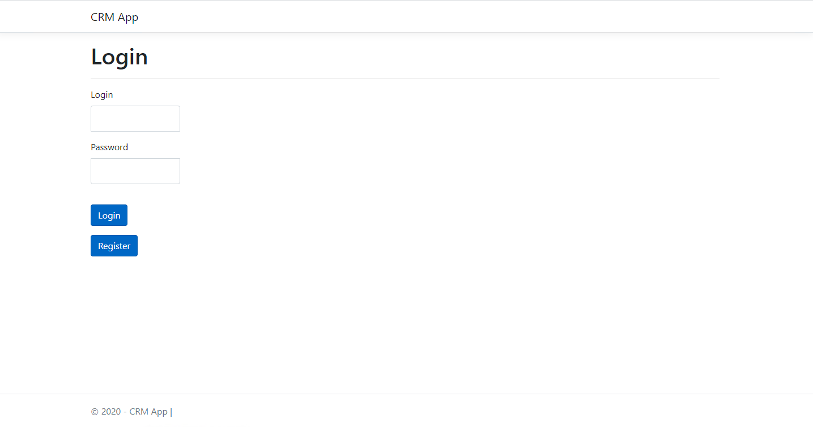
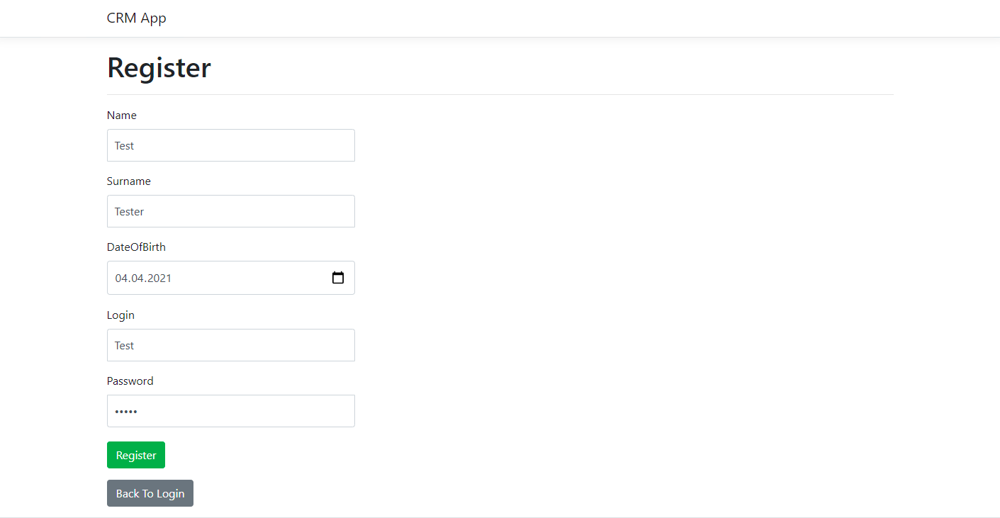
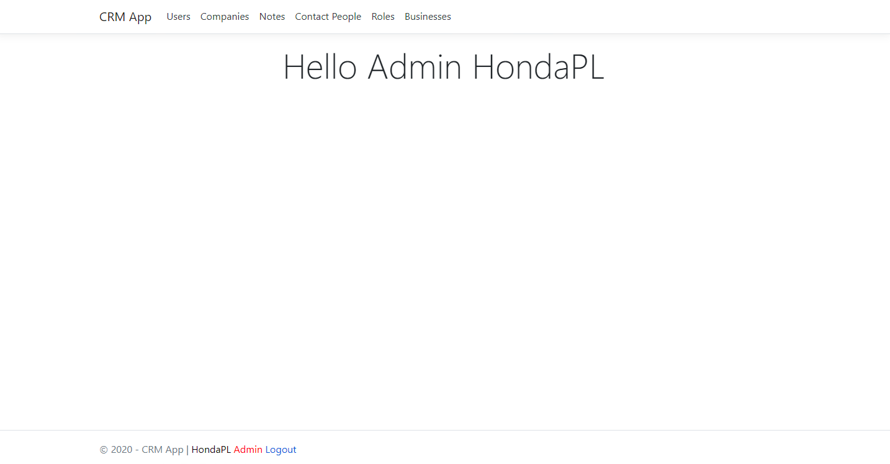
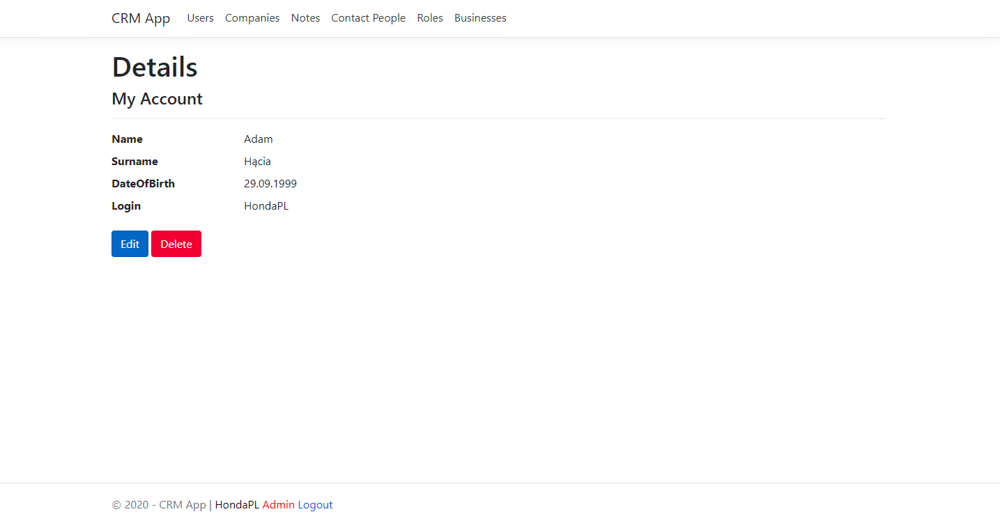
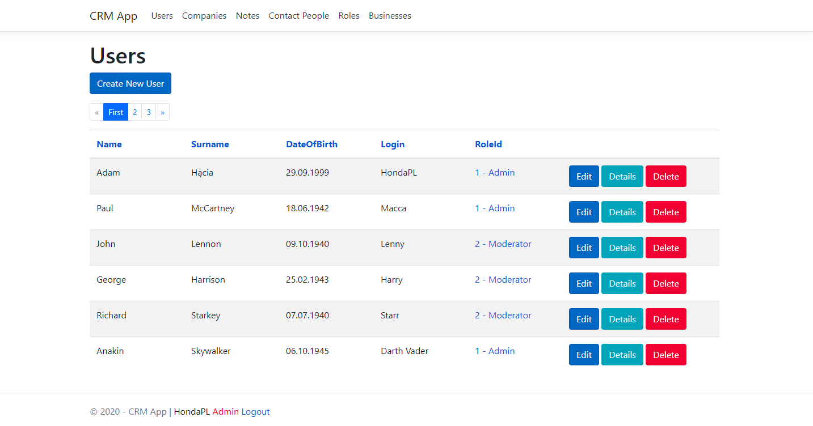
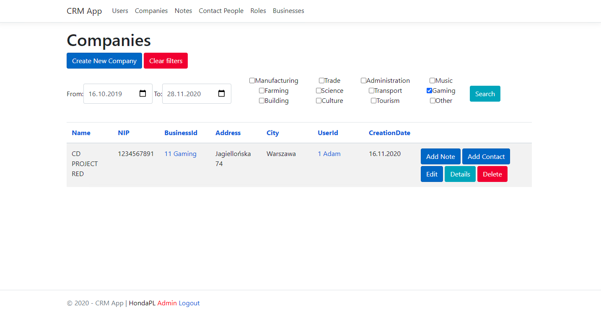
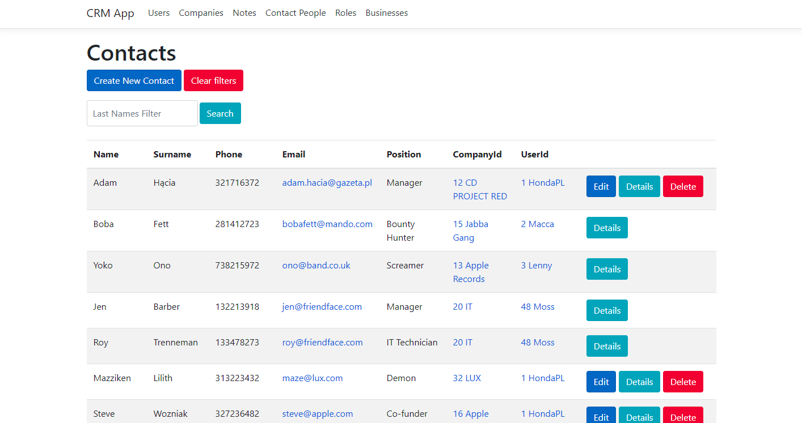
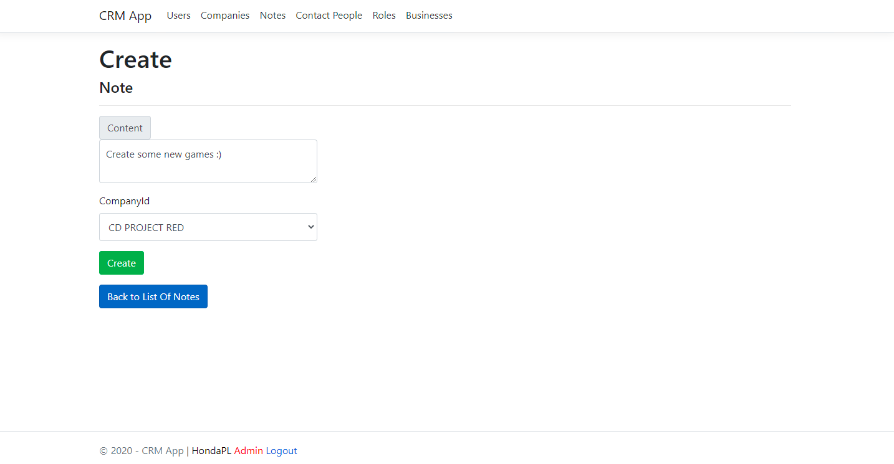
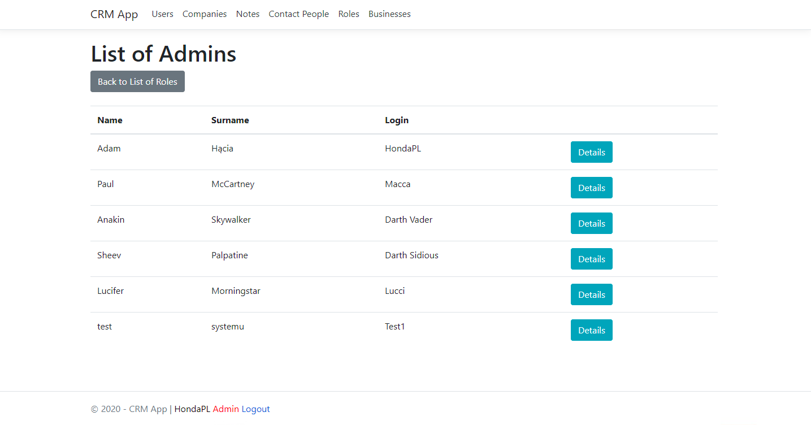
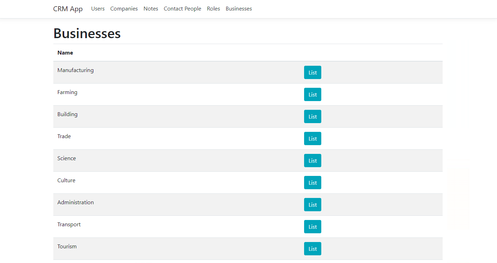

# CRM
> Simple CRM model in C# using .NET 3.1 created for Programing classes.

## Table of contents
- [CRM](#crm)
  - [Table of contents](#table-of-contents)
  - [Screenshots](#screenshots)
  - [Technologies](#technologies)
  - [Setup](#setup)
  - [Features](#features)
  - [Status](#status)
  - [Inspiration](#inspiration)
  - [Contact](#contact)

## Screenshots
Login page

Registration page

Landing page

My account page

Users list

Companies list with given filter

Contacts list with surname filter

Adding new note to the company

Showing list of users with specific role

Businesses list

## Technologies
* C# 
* .NET 3.1

## Setup
Open ```CRM.sln``` file in Visual Studio and run the app. 

Open http://localhost:5001 to view it in the browser.

## Features
* MVC (Model-View-Controller) app
* Login/Registration model
* 3 types of roles: Admin, Moderator and User
* Specific views for each role
* Filtering system for searching for specific types of companies or searching companies with creation date in specific range.
* Filtering contacts by surname
* Paging and listing users and companies.
* Checking authentication
* Keeping all informations in local data base
  
## Status
Project is: _completed_

## Inspiration
We had to do CRM model, so I decieded to do it in .NET to learn that technology.

## Contact
Created by [@HondaPL](https://hacia.students.wmi.amu.edu.pl/) 2020

